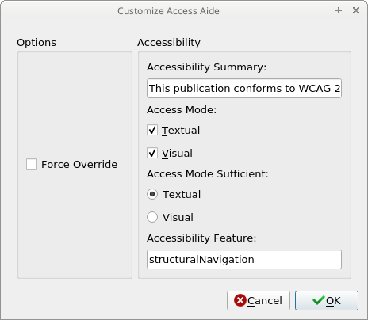
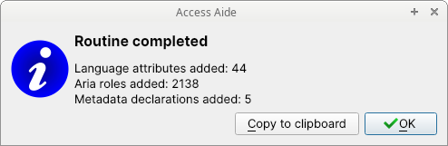

# Access Aide
_Access Aide_ is a Calibre (book editor) plug-in to enhance EPUBs with accessibility features and help comply with the WCAG guidelines.

This plug-in is especially suited for people producing EPUBs through InDesign, but other users might find _Access Aide_ useful. At the time of writing, InDesign is capable of adding language information to OPF files and appropriate epub:type to HTML tags. Access Aide reads this information and adds language declarations, aria roles and metadata statements to comply with the WCAG guidelines for accessible publications.

## Features
 -  Add language declaration to `<html>` tags;
 -  Find tags with `epub:type` attributes and add corresponding aria roles;
 -  Add accessibility declarations to book metadata:
    + schema:accessMode, schema:accessibilityFeature, schema:accessibilityHazard, schema:accessibilitySummary, schema:accessModeSufficient;
    + a11y:certifiedBy, a11y:certifierCredential, a11y:certifierReport.

# Installation

You can either:

 - Install this plugin via the [plug-in manager tool](https://manual.calibre-ebook.com/customize.html#customizing-calibre-with-plugins) in your Calibre client `Preferences -> Advanced -> Plug-ins -> Get new plug-ins`;
 - Manually download a release from this repository and then load the zip file by `Preferences -> Advanced -> Plug-ins -> Load plugin from file`.

## Config
Plugin behaviour can be fine tuned via plugin config dialogue.

## Use
Open the book to enhance in the [Calibre ebook editor](https://manual.calibre-ebook.com/edit.html) and start Access Aide. This can be performed clicking Plugins -> Access Aide, or via Ctrl+Shift+a.

# License
Copyright (C) 2020-2022 Luca Baffa
GPL v3.0

## Acknowledgements

This project aims to port the functionalities of the excellent [Access-Aide](https://github.com/kevinhendricks/Access-Aide) LGPL v2.1 Sigil plugin to Calibre.

The plugin icon (`./icon/icon.png`) comes from the `adwaita-icon-theme` pack ([gitlab page](https://gitlab.gnome.org/GNOME/adwaita-icon-theme) of the project), released as LGPL v3 by the GNOME Project.

The GitHub icon (`./icon/GitHub-Mark-32px.png`) was downloaded from the [dedicated web page](https://github.com/logos) and it is used as the icon of the button which links to this GitHub repository.
