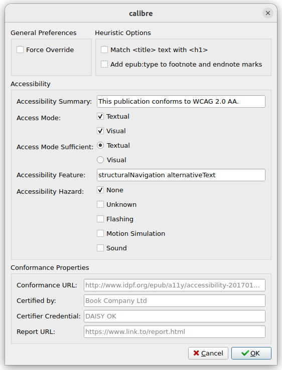

# Access Aide
_Access Aide_ is a Calibre (book editor) plugin to enhance epubs with accessibility features.

# Features
 -  Add language declaration to `<html>` tags;
 -  Map epub:type attributes to their appropriate aria role attribute.
 -  Add accessibility declarations to book metadata.

# Usage
## Config
Plugin behaviour can be fine tuned via plugin config dialogue.

## Use
Open the book to enhance in the Calibre ebook editor and start Access Aide. This can be performed clicking Plugins -> Access Aide, or via Ctrl+Shift+a.

# License
Source code by Luca Baffa, released under the GPL 3 licence.

This project is _heavily influenced_ and inherits part of the code from the [Access-Aide](https://github.com/kevinhendricks/Access-Aide) LGPL v2.1 plugin developed for Sigil.

The plugin icon (`./icon/icon.png`) comes from the `adwaita-icon-theme` pack ([gitlab page](https://gitlab.gnome.org/GNOME/adwaita-icon-theme) of the project), released as LGPL v3 by the GNOME Project.
